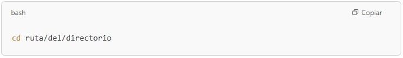
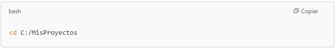

## 
 **¿Como crear un repositorio local con comando de Git?**

Se pretende explicar el proceso para crear un repositorio local con comandos de Git en **GITBASH**

### 1. Se abre Gitbash
Esta es una aplicacion que puede no estar incorporada en todos las versiones de Windows, por lo que si no se debera descargar

[Imagen Gitbash](https://worldvectorlogo.com/es/logo/git-bash)

### 2. Navega hasta la carpeta donde deseas crear el repositorio 

Usa el comando cd (change directory) para moverte a la carpeta donde quieres crear el repositorio.

por ejemplo:

### 3. Inicializa el repositorio local 

Una vez que estés en la carpeta deseada, utiliza el siguiente comando para inicializar el repositorio local:

### 3. Inicializa el repositorio local 

Esto creará un nuevo repositorio de Git en esa carpeta, generando un subdirectorio .git donde se almacenan los archivos de control de versiones.

### 4. Agrega archivos al repositorio

 Si tienes archivos en esa carpeta que deseas agregar al repositorio, usa el comando git add para agregar archivos específicos o todos los archivos.Para agregar todos los archivos, usa:

 Si solo quieres agregar un archivo en particular, por ejemplo archivo.txt, usa:

### 4. Haz tu primer commit 
 Después de agregar los archivos, realiza un commit con el siguiente comando:

 

Asegúrate de reemplazar el mensaje con algo significativo, como "Primer commit" o cualquier descripción que se ajuste a los cambios realizados.

## 
**Lo has logrado ahora puedes desarrollar tu proyecto de manera local y tener un control de version del mismo**

