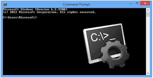

## 
**¿Como usar la consola basica de Git en **GITBASH** (consola de comandos)**

En Gitbash que para algunos dispositivo sera la consola de comandos; se tienen comandos basicos que permiten hacer variedad de acciones, cambios entre otros. 

[Imagen consola de comandos](https://mascandobits.es/tips/copy-pega-en-la-consola-de-comando-de-windows/)

Alguno de los principales son: 

### **1.ls**

Muestra el listado de archivos y directorios en el directorio actual.

### **2.ls -la**

Muestra el listado de archivos y directorios, incluyendo los ocultos, con detalles (como permisos, tamaño, fecha, etc.).

### **3.mv origen a destino**

Mueve o renombra archivos o directorios.

### **4. vim**

Abre un archivo en el editor de texto vim (un editor de terminal).

### **4.touch**

Crea un nuevo archivo vacío o actualiza la fecha de modificación de un archivo existente.

### **5.cat**

Muestra el contenido de un archivo en la terminal.

### **6.rm**

Elimina un archivo (sin posibilidad de recuperación).

### **6.rm -r**

Elimina un directorio y su contenido de forma recursiva.

### **7.mkdir**
Crea un nuevo directorio.

### **8.cd**

Cambia el directorio de trabajo actual al especificado. Por ejemplo:

1. **cd carpeta/**: Te lleva a la carpeta llamada carpeta.

2. **cd ..**: Te lleva al directorio superior (padre).

3. **cd ~**: Te lleva al directorio home de tu usuario.

4. **cd /**: Te lleva al directorio raíz del sistema de archivos.

### **8.find**
Para buscar archivos y directorios, se pueden buscar por el nombre o el tipo. 

### **9.pwd**
El comando pwd significa "Print Working Directory", y muestra la ruta completa del directorio en el que te encuentras actualmente.

### **10.(.) punto**
 el punto . se refiere al directorio actual. Es un acceso rápido para referirse al directorio en el que te encuentras.

### **11. (/) barra diagonal**
 es el separador de directorios. En Git y en la terminal, se utiliza para navegar entre directorios o para especificar rutas absolutas o relativas.

 

## 
**Lo has logrado ahora puedes jugar y moverte en el explorador de archivos con la consola de comandos**

